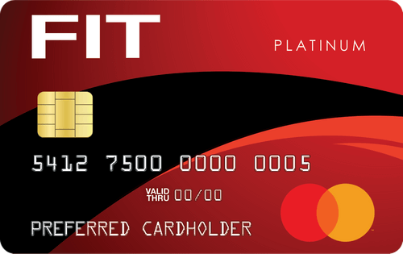

> We have proposed a system for electronic transactions without relying on trust.
>
> — Satoshi Nakamoto
> “Bitcoin: A Peer-to-Peer Electronic Cash System”

I'm currently a `Tech Lead` at **Capital One**, working on systems that enable `tokenization` of issued credit cards by the bank.
Payment Technology is one of my faviorite areas of software engineering.
With in Payment Technology you are exposed to multiple areas of computer science & technology such as:
- TCP/IP and SOCKET connections to communicate to banks via the `ISO8583` messaging standard
- Distributed systems
- Micro Service Application Architecture
- Transactional databases inclduing Transaction Isolation Levels
- Database design
- Software Security from configurations, injection, Computer System representation of Data.
- Legacy Systems to process payments and the effort to modernize to keep up with a changing world of how people think about money.

There were some years I worked at `Zoom Video Communications`, owning the `Live Video experience` for the `Contact Center` product. If you were ever used customer support over SMS and thought, can i just call this support agent now because it would be easier for me to describe, then this is the product that should excite you. My responsibility was to combine session channels when requested and move details over to those channels when prompted to provide a seamless experience for the Customer Support Agent and the End User. This is where i grew the most in the sense of `product engineer`. This required to work with partners to gather requirements, meet with internal teams who owned the native channels like Zoom Voice, Zoom Video, Zoom SMS to then build out a flow to provide to the client and front end engineers with the Design team and bring the feature to the finish line. Take a look below as it was presented during the **2022 Zoomtopia Event**. What was the most important thing at Zoom was the ability to communicate ideas, flows, and objectives as fast as possible to keep competitive with the market.

### Contact Center Channel Switching Zoomtopia Demo!
<iframe width="560" height="315" src="https://www.youtube.com/embed/YdiZyvjzlqU?si=lggC_nuBkhBbkz9m&amp;start=5425" title="YouTube video player" frameborder="0" allow="accelerometer; autoplay; clipboard-write; encrypted-media; gyroscope; picture-in-picture; web-share" referrerpolicy="strict-origin-when-cross-origin" allowfullscreen></iframe>

I left `Zoom` at the end of **2024**. The company has the market cornered in terms of Video Communication technnology. Where I worked was, Contact Center. This left me hungry to grow again. My intrest came back to payments. The payment product that software engineers provides is very different than something like Zoom Contact Center. We could be leaking water behind the sceances like most software eventually becomes with rapid innovation, but if the process did not work, the business partners would be fursious, as they should be. 

In payments, we have a lot of partners and customers who rely on us. The partners (Payment Processors) like Adyen or Paylocity, The Merchants like Starbuck or Amazon Store, and you, the end user. Now when we use our credit/debit cards, we think of that as a bank. Rarley do i hear that its a product outside of the financial world. We get credit card points, a balance, a limit, a place to store your capital. But when your credit card doesn't work, you might call your bank and spend the next 15 minutes trying to figure that out. But if you have screaming kids and your tired, you'll just use a different credit card and figure out the issue later.

When you are leading an engineering scrum team, the goal for the engineers is to follow the Story, meet the acceptance criteria, ensure the code coverage defined by team is met, then demo. After that, we don't really see our customers using the product. Leading the team who is an entry point for `tokenization` we have more insight, but a team that is responsible for `PAR` (Payment Account Reference) to map to `PAN`, the customers Payment Account Number, we are dealing with a different objective. What i do is ensure those details are communicated. For example, In distribtued sytems, its important that we validate our data (sanitize input and sanitize output) to ensure that garbage in does not equal garbage out. If we have a critial `number` we must provide to our Partners, think paypal because they will manage the customers credit card on their platform. How would you think of our credit card number?

Credit Card Number -> `541275000000005`
How would you represent this number as a Product Owner? What about as a Software Engineer?
Think of it this way. if i tell you to add 10 to your credit card number, you know what to do. you would take `541275000000005` + `10` to get `541275000000015`. What if i told you to add 10 to your name? In software we use **ASCII** code to represent numbers and Character Encodings. So, `10` in characters is `\n` and someone that deals with these encodings might assume that you want to add a new line (`\n`) to your name. 

But when we deal with computers we want to use Integers. so back to my point on bridging the gap for Product and Engineering, when a payment partner asks for the `last 4 pan`, the last four of your credit card number, they would expect you to give them `0005`. But if you are using a number in the computer sense of C++ or Java you might just give them back `5`. Then they are left wondering where the other three digits are and have no way of knowing what you are trying to give them.

In simple terms. What is the number `0005`? its just `5` no matter how many leading digits (characters) there are. But, `0005` can be a valid pin number, pan last 4, phone password. 

Imaging on your iPhone your iOS code asks you to create a passcode and you enter `0007`, because you are James Bond ofcourse. But when you try to unlock your phone you can't because the stored password now is represented as a number which would be `7`. So you figure this out and type `7` and your iphone now is expecting at the least 3 more digits. 

To wrap it up and cut it short because I would love to talk (or type) your ear (or eyes) off talking about how imporant payments are, this is the engine that enables people to live. I think about the ability to move around in the world directly connected to how you are able to move money.

My Grandfather had to leave his home in Garea, Tripoli, Greece in 1941 at the age of 16. He landed in Toronto Canada, much like a lot of immigrants, with nothing but his 5 brothers. Those years leading up to where i am today, they ran resturants and bars. I grew up in the resturant industry and collecting payments, seeing how they evolve has been the lifes blood of my family. If the payment was fraudulate, delayed, then we migth be in a bind. When we would go back to Greece in the 1990's we left Chicago with only the Cash we had on hand. 

Today, i can leave Chicago and visit my Yiayia in the mountains of Vytina Greece with only my Digital Credit Cards loaded into Apple Pay. 

